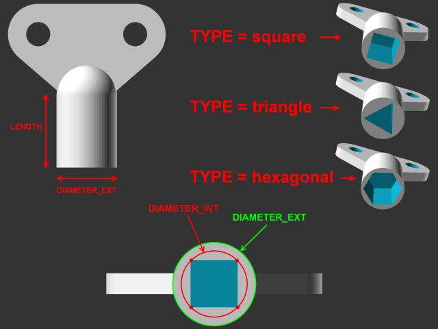
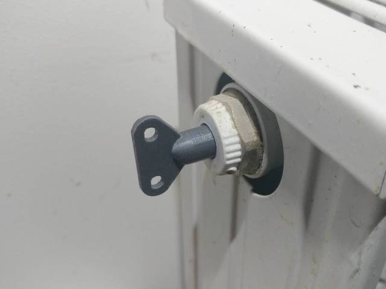

# Présentation

Une clé universelle (triangle, carrée, pentagonale, hexagonale, etc ...)

Il y a 2 versions :

Une version prévue pour l'application en ligne « Thingiverse Customizer » : **universal_key_customizer.scad**

Une version pour ceux qui ont le logiciel Openscad : **universal_key.scad**

Pour information, j'avais auparavant modélisé une clé de purge de radiateur (c'est une clé carrée de 5mm) avec le logiciel AUTODESK Fusion 360.

Entre temps j'ai découvert la modélisation avec OpenScad et j'ai réalisé que modéliser une clé universelle avec OpenScad n'était pas si compliqué que cela !

La voici-donc.

Les paramètres modifiables par l'utilisateur sont : NB_SIDES, DIAMETER_EXT, DIAMETER_INT et LENGTH

Sur la version « Thingiverse Customizer », Le paramètre NB_SIDES est remplacé par le paramètre TYPE

# Quelques images

